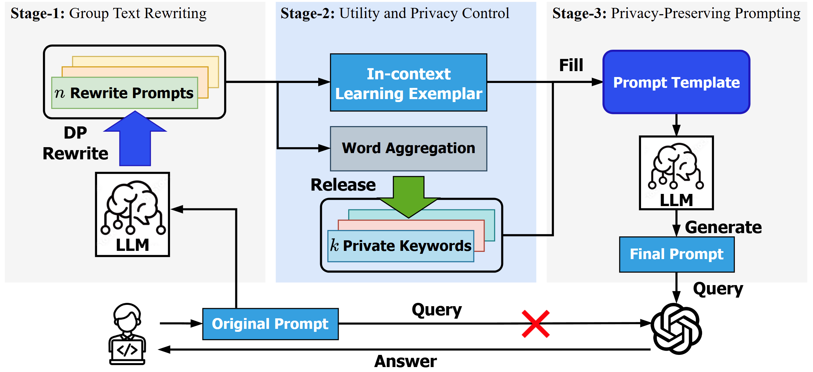

# The code repo for DP-GTR 
DP-GTR is a three-stage differentially private prompt protection framework designed to safeguard text inputs in client-side applications. Leveraging our novel Group Text Rewriting (GTR) mechanism, \modelname seamlessly bridges local and global differential privacy (DP) paradigms, enabling the integration of diverse DP techniques for superior privacy-utility tradeoffs.



## How to use
1. Setup the OpenAI API keys. (We use Azure OpenAI API)
```json
{
    "api_key": "",
    "api_base": "",
    "api_type": "azure",
    "api_version": "",
    "deployment_name": {
        "GPT3.5": "GPT35",  // The deployment name for GPT3.5
    }
}
```

2. Define your own dp paraphrase function and call the gtr to Group Text Rewrite the input text.
```python
from GTR import GTR
from openai_generation import dp_paraphrase, generation
gtr = GTR()
text = "In which year, john f. kennedy was assassinated?"
rewrites = GTR.gtr(text, dp_paraphrase)
```

3. Build final prompt from contextual rewrites.
```python
final_prompt = GTR.icl(rewrites, generation)
```

## DP-GTR parameters
- `num_rewrites`: The number of rewrites to generate.
- `releasing_strategy`: either `ndp`(non-dp) or `jem`(Joint-EM).
- `remian_tokens`: The number of tokens to release and avoid in final generation. 

## Use Open-source LLM
We also provide the code to use the open-source LLMs like Llama-3.1-8B, GPT-2, etc. 
```python
from dpps.SLM import SLM
from utils import prompt_template
slm = SLM("meta-llama/Llama-3.1-8B-Instruct")

text = slm.generate_clean(input_text=prompt_template(text), ref_text=text)
```